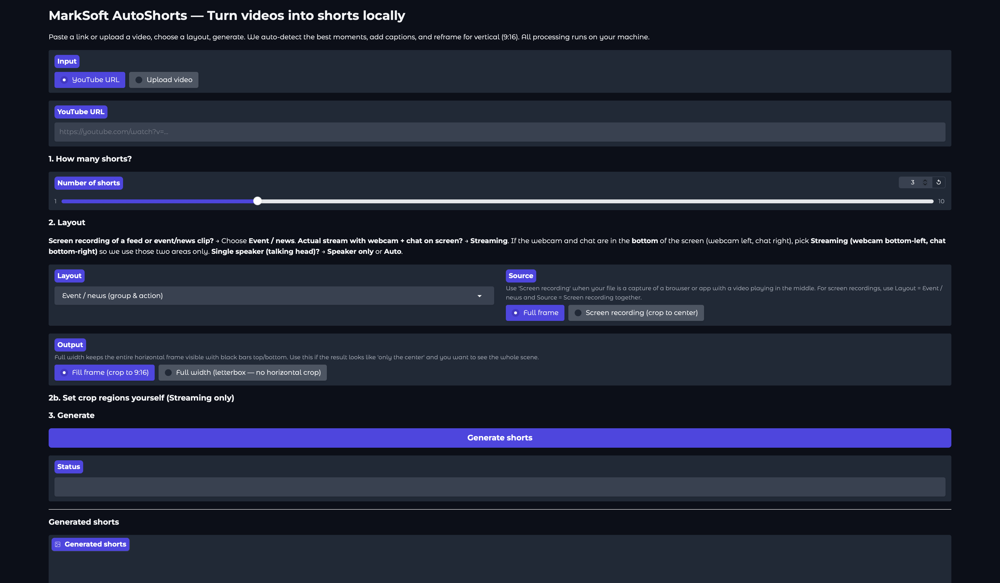

# MarkSoft AutoShorts



Turn long videos, **YouTube**, **Twitch**, **Kick**, or your own files into short clips (Shorts / Reels / TikTok) using **only local tools**: no cloud APIs, no sign-up. All processing runs on your machine.

---

## What it does

- **Transcribes** the video with [faster-whisper](https://github.com/SYSTRAN/faster-whisper)
- **Finds viral moments** with a local LLM via [Ollama](https://ollama.ai)
- **Cuts, crops to 9:16, and burns captions** with [FFmpeg](https://ffmpeg.org)
- **Smart reframe:** face tracking ([MediaPipe](https://mediapipe.dev)), multiple layouts (streaming webcam+chat, split screen, speaker center, event/news), manual crop regions with preview and presets
- **Optional:** use a **YouTube**, **Twitch**, or **Kick** URL (downloads with [yt-dlp](https://github.com/yt-dlp/yt-dlp)); or **upload a video** from your machine (file is copied to `downloads/` for the run).

---

## How clip selection works (workflow)

The app uses **transcript + AI** to decide what to clip. Clips are aligned to **sentence boundaries** and extended to include the payoff (punch line). Here’s the flow.

**1. Transcribe the video**  
[faster-whisper](https://github.com/SYSTRAN/faster-whisper) turns speech into **segments**: short phrases with start/end times (e.g. “So then he said…” from 12.3s to 14.1s). No AI yet — just speech-to-text.

**2. AI finds all short-worthy moments**  
Your local LLM ([Ollama](https://ollama.ai), e.g. Mistral) sees the **full transcript as short segments** (with timestamps). It is asked to find **every moment** that would make a good short: hook + payoff, 15–35s, self-contained. It returns **1 to N** ranges (segment start_idx → end_idx). The number of shorts is **dynamic**: if the video has 5 strong moments you get 5; if only 2, you get 2. No fixed time windows.

**3. Clip boundaries (no mid-sentence, include payoff)**  
- **Start:** The pipeline moves the start **back to a sentence boundary** (previous segment ends with `.?!` or segment starts with a capital), so clips don’t start mid-sentence. Walk-back is capped at **12 seconds** so we don’t pull in too much.
- **End:** The end is **extended** to include the next phrase (up to ~8s, 2 segments) and **stops at a sentence end** (`.?!`) so the punch line isn’t cut off. A small **end padding** (default 3s) is added, and total length is capped at **35 seconds** by default (configurable via `--max-duration`).

**4. Export**  
For each clip (with these boundaries), the app cuts the video, applies your layout (crop/reframe), burns captions, and saves a 9:16 MP4. Full and per-short transcripts are saved in the run folder and shown in the **History** tab.

**Summary**

| Step | What happens |
|------|----------------------|
| 1. Transcribe | Whisper → segments (phrase-level start/end + text) |
| 2. Select | LLM sees full transcript as segments; finds every good moment (1 to N), returns segment ranges |
| 3. Boundaries | Start: sentence-bound (cap 12s back). End: extend for payoff (~8s), stop at sentence, cap 35s |
| 4. Export | Cut video, crop to layout, burn captions, save transcripts → short |

---

## Prerequisites (install once)

| Tool | Install |
|------|--------|
| **FFmpeg** | `brew install ffmpeg` (macOS) or `apt install ffmpeg` (Linux). For burned-in captions: `brew install libass` then `brew reinstall ffmpeg` if you see "No such filter: 'subtitles'". |
| **Python 3.11+** | `brew install python@3.11` or [pyenv](https://github.com/pyenv/pyenv) (macOS); `apt install python3.11 python3.11-venv` (Linux). |
| **Ollama** | [ollama.ai](https://ollama.ai), then run: `ollama pull mistral` |

---

## Quick start

```bash
cd AutoAI
python3 -m venv venv
source venv/bin/activate   # Windows: venv\Scripts\activate
pip install -r requirements.txt
```

**CLI — generate 3 shorts from a YouTube video:**

```bash
python cli.py "https://youtube.com/watch?v=VIDEO_ID" -o ./my_shorts -n 3
```

**CLI — from a local file:**

```bash
python cli.py /path/to/video.mp4 -n 5
```

Output: `./my_shorts/short_1.mp4`, `short_2.mp4`, … (9:16, with burned-in captions).

**Web UI:**

```bash
python app_gradio.py
```

Open the URL shown (e.g. http://127.0.0.1:7860).

---

## Everything to know

### 1. Input

- **Video URL** — Paste a YouTube, Twitch, or Kick link (e.g. `https://twitch.tv/videos/...`, `https://kick.com/video/...`); the app downloads the video with yt-dlp (saved to `downloads/`).
- **Upload video** — Use a local file. The file is copied into `downloads/` so the run is stable (Gradio temp files can be removed). No upload to any server.

### 2. Number of shorts

Choose how many clips to generate (1–10). The app picks that many “best moments” from the transcript using the local LLM (Ollama).

### 3. Layout

How the video is cropped and arranged for vertical 9:16:

| Layout | Use when |
|--------|----------|
| **Auto** | Let the app detect: if it sees a face in the left half → Streaming; otherwise → Speaker only or Event. |
| **Event / news** | Chaotic or multi-person footage (e.g. events, news, rescue). Tracks people and crops to keep action in frame. |
| **Streaming (webcam top, chat bottom)** | A stream with webcam + chat on screen. App tries to find the webcam (face) and chat area; use **Set crop regions yourself** if it’s wrong. |
| **Streaming (webcam bottom-left, chat bottom-right)** | Same idea but for layouts where webcam and chat are in the **bottom** of the frame (fixed regions, no detection). |
| **Speaker only** | Single talking head; keeps the face centered. |
| **Split screen** | Splits the frame (bottom-left and bottom-right) and stacks them vertically. |

### 4. Source

- **Full frame** — Use the whole video frame as-is.
- **Screen recording (crop to center)** — For a recording of a browser/app where the real content is in the middle. The app crops to the center 70%×90% first, then applies the layout.

### 5. Output

- **Fill frame (crop to 9:16)** — Scale to fill the vertical frame and center-crop; no black bars.
- **Full width (letterbox)** — Keep the full width of the video and add black bars top/bottom so nothing is cropped horizontally.

### 6. Set crop regions yourself (Streaming only)

When you pick a **Streaming** layout, you can open **“I'll select the webcam and chat areas myself”** and:

- **Use my crop regions** — Turn off auto-detect; the app uses your numbers only.
- **Webcam / Chat / Middle** — Three columns with **Left %, Top %, Right %, Bottom %** (0–100). Same idea for all three: you define a rectangle on the full video. **Webcam** = top of the short, **Chat** = bottom, **Middle** = the strip between them (gap fill). Default for Middle is 25–75 (center of the frame).
- **Saved presets** — Load, save, rename, or delete presets so you don’t re-enter values every time.
- **Preview regions on a frame** — Draws green (webcam), orange (chat), and blue (middle) boxes on a frame so you can check before generating.
- **Preview final layout (9:16)** — Shows exactly how the short will look: webcam on top, middle in the center (if there’s a gap), chat on bottom.

### 7. Generate

Click **Generate shorts**. The app will:

1. Download the video (if URL) or use your file.
2. Transcribe with Whisper.
3. Ask Ollama for the best N segments.
4. For each segment: cut, apply the chosen layout (and your crop regions if set), burn captions, save as 9:16 MP4.

**Where files go:**

- **Downloads:** `downloads/` (YouTube videos).
- **Generated shorts:** `generated/YYYY-MM-DD_HH-MM-SS/` (one folder per run): `short_1.mp4`, `short_2.mp4`, … and `run_metadata.json` (titles, full transcript, per-short transcripts).

### 8. History, Upload, and Edit (tabs)

Under **Generated shorts** there are three tabs:

| Tab | What it shows |
|-----|----------------|
| **This run** | Gallery of the shorts you just generated. |
| **History** | Browse by **From video** and **Run**. Table (Title \| Generated \| Transcript), **Play shorts** gallery, **Transcript** dropdown, **Upload to YouTube** (short to upload, title, description, privacy), and **Edit short** (pick a short, enter a prompt, Apply edit). |
| **Edited** | Same run as in History. Table and **Play edited shorts** gallery for any trimmed versions (`short_1_edited.mp4`, etc.). After you use **Edit short**, switch here to play the result. |

**Edit short** uses the same AI (Ollama) to turn a natural-language prompt into trim instructions, then FFmpeg applies the trim. Examples:

- *Cut the last 3 seconds* — removes the final 3 seconds.
- *Cut the first 2 seconds* — removes the first 2 seconds.
- *Keep the first 22 seconds* — keeps 0–22s and removes the rest (useful to shorten a short to a fixed length).
- *Remove first 2 and last 3* — trims both ends.

Edited files are saved as `short_N_edited.mp4` in the same run folder and appear in the **Edited** tab so you can play them like the generated shorts.

### 9. History and transcripts

- **From video / Run** — Browse past runs by source video and timestamp. The table lists each short’s title and generation time; the **Transcript** column points to the transcript viewer below.
- **Transcript** — Open the **Transcript** accordion and use **Show transcript** to pick **Full video** or **Short 1: &lt;title&gt;** (etc.). One transcript is shown at a time in a scrollable area. Older runs without saved transcripts show a placeholder message.

### 10. Optional: YouTube upload

To upload a generated short to YouTube from the app, you need OAuth credentials:

1. Create a project in [Google Cloud Console](https://console.cloud.google.com/) and enable the YouTube Data API v3.
2. Create OAuth 2.0 credentials (Desktop app). Download the JSON and save it as `youtube_client_secret.json` in the project root.
3. The first time you click **Upload selected short to YouTube**, the app will open a browser to sign in and save a token to `youtube_token.json` (both files are in `.gitignore`).

Then use **Short to upload**, set title/description and privacy, and click **Upload selected short to YouTube**.

---

## CLI reference

| Option | Description | Default |
|--------|-------------|--------|
| `source` | Video URL (YouTube, Twitch, Kick, etc.) or path to video file | — |
| `-o`, `--output-dir` | Output folder for shorts | `./shorts_out` |
| `-n`, `--num-clips` | Number of shorts to generate | 3 |
| `--whisper-model` | Whisper size: tiny, base, small, medium, large-v2, large-v3 | base |
| `--ollama-model` | Ollama model for highlight selection | mistral |
| `--chunk-duration` | Chunk length (sec) for LLM analysis | 30 |
| `--min-duration` / `--max-duration` | Min/max clip length (sec) | 15 / 35 |
| `--no-captions` | Skip burning captions | off |

Example with more clips and a custom output folder:

```bash
python cli.py "https://youtube.com/watch?v=VIDEO_ID" -o ./my_shorts -n 5
```

---

## Features (current)

- Video URL (YouTube, Twitch, Kick) + local file input + upload (file copied to `downloads/`)  
- Transcription (faster-whisper), AI highlight selection (Ollama), sentence-bound clip boundaries, payoff extension  
- Default clip length 15–35s (configurable); start at sentence, end after punch line  
- Layouts: Auto, Event/news, Streaming (two variants), Speaker only, Split screen  
- Full frame vs screen recording (crop to center)  
- Fill frame vs full-width letterbox output  
- Manual crop regions for webcam, chat, and middle (gap fill) with presets  
- Preview regions on a frame + preview final 9:16 layout  
- Burned-in captions (SRT → FFmpeg)  
- **History tab:** browse runs by video and timestamp; **Transcript** dropdown (full video or per short) in a single scrollable view  
- **Upload to YouTube** and **Edit short** in the History tab; **Edited** tab to play trimmed shorts (same table + gallery as generated)  
- **Edit short with AI:** natural-language trim (e.g. *Cut the last 3 seconds*, *Keep the first 22 seconds*); saves as `short_N_edited.mp4`, play in **Edited** tab  
- Optional YouTube upload (OAuth: `youtube_client_secret.json` + `youtube_token.json`)  
- 9:16 MP4 (H.264), 100% local

See **[docs/FEATURE_PARITY.md](docs/FEATURE_PARITY.md)** for the full feature list and possible roadmap.  
See **[docs/TOOLS_AND_SETUP.md](docs/TOOLS_AND_SETUP.md)** for tools (FFmpeg, Whisper, Ollama, yt-dlp) and pipeline overview.

---

## Troubleshooting

- **“No such filter: 'subtitles'”** — Install libass and rebuild FFmpeg: `brew install libass` then `brew reinstall ffmpeg`. Shorts still generate; captions are skipped and SRT files are saved.
- **Ollama errors** — Ensure Ollama is running and you’ve run `ollama pull mistral` (or the model you use).
- **Cropping wrong for streaming** — Use **Set crop regions yourself**, enter Left/Top/Right/Bottom % for webcam and chat, enable **Use my crop regions**, then **Preview regions on a frame** to confirm before generating.
- **Middle part looks off** — Adjust the **Middle** column (Left/Top/Right/Bottom %). Lower **Top %** to include more above the subject; use **Preview final layout (9:16)** to check.
- **Punch line or end of clip is cut off** — The pipeline trims the start to a sentence boundary (up to 12s back) and extends the end to include the next phrase (~8s) and stop at a sentence end (`.?!`), capped at `--max-duration` (default 35s). If a line is still cut, try a larger Whisper model (better punctuation) or increase `--max-duration`. Transcripts in **History → Transcript** let you confirm what was included.

---

## License

MIT.
